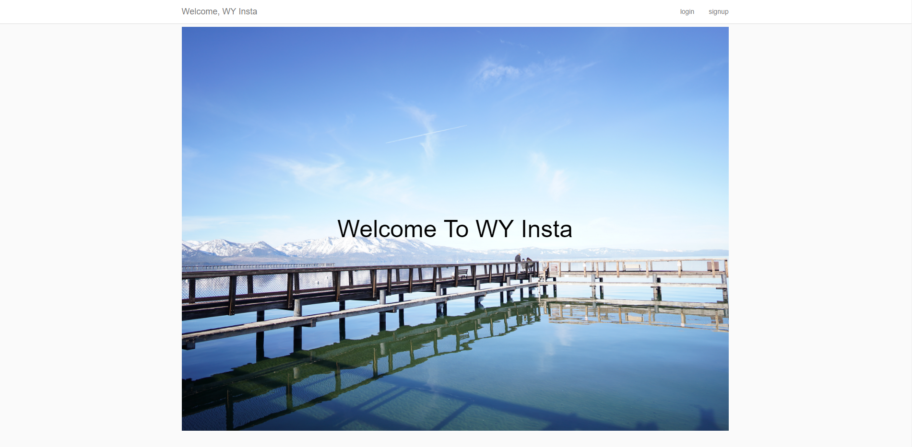
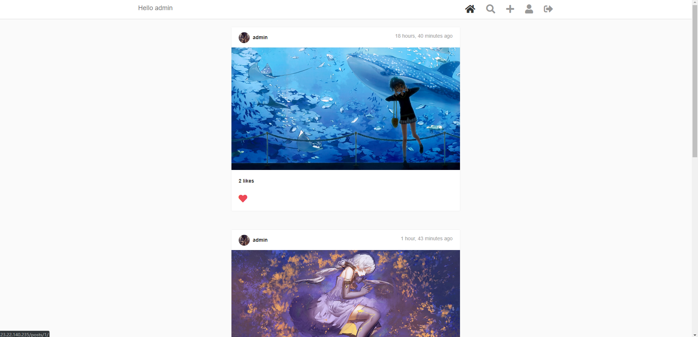
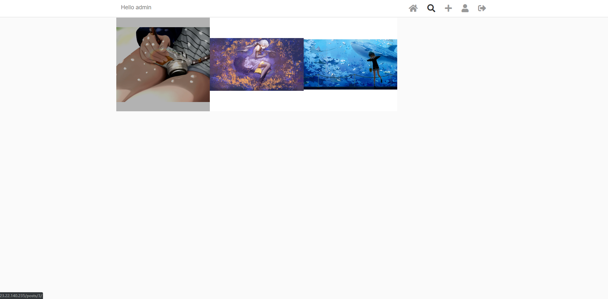
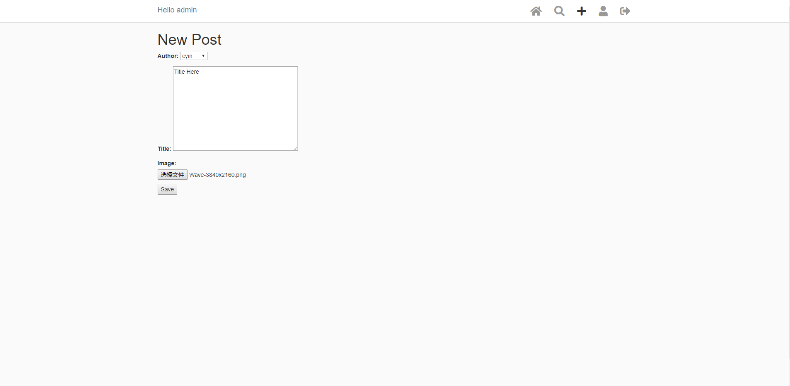
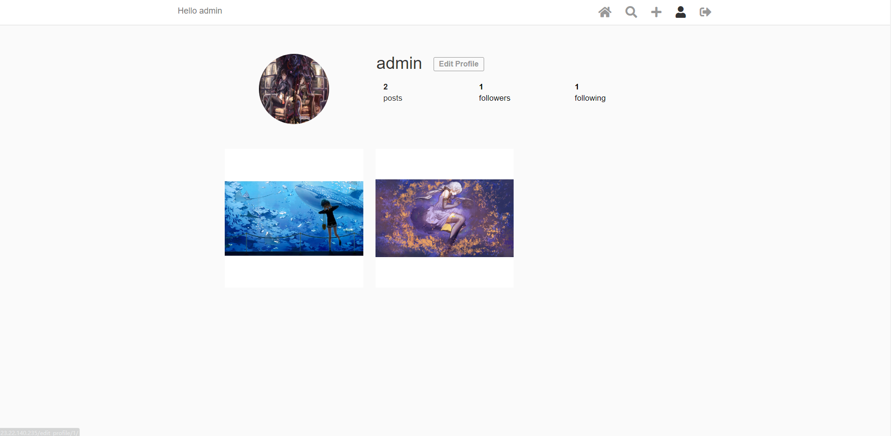
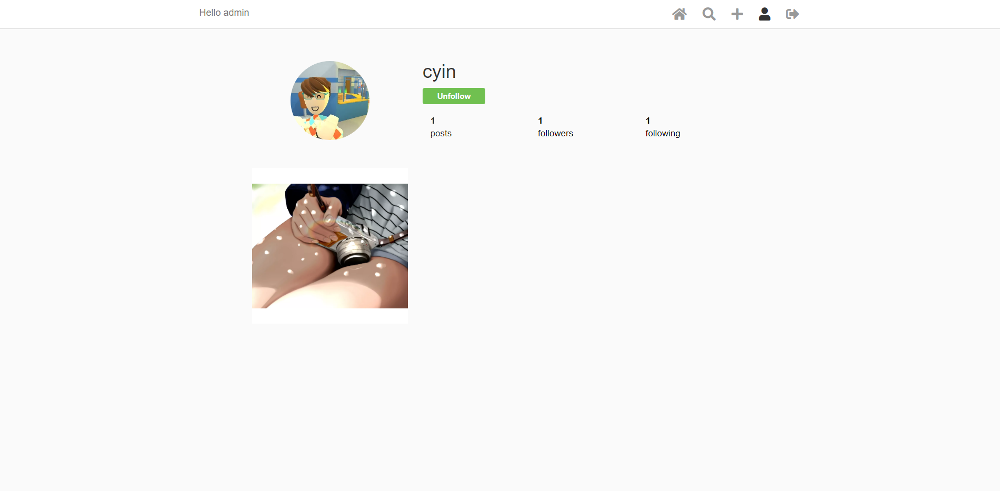
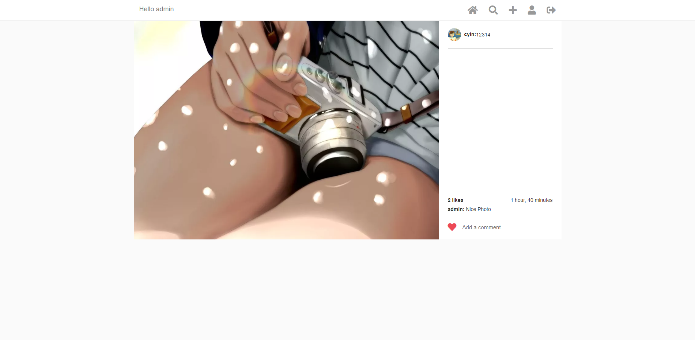
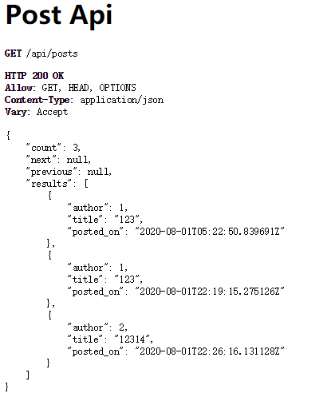
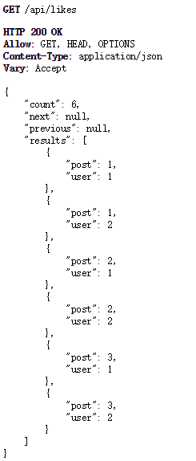

# Insta-like Web Application(Django & AWS LightSail)

[Link to Website](http://www.wyinsta.com//)

## Pages

- ### Home Page

  

- ### Home Page(after login)

  

- ### Explore Page

  

- ### Create New Post

  

- ### Profile Page

  

- ### Profile Page(Others')

  

- ### Post Detail
  

## APIs

- ### api/posts

  

- ### api/likes
  

## FramWork

- ##### Deployed on AWS LightSail (Load-balancing Enable)
- ##### Use Django + Apache2 Framework
